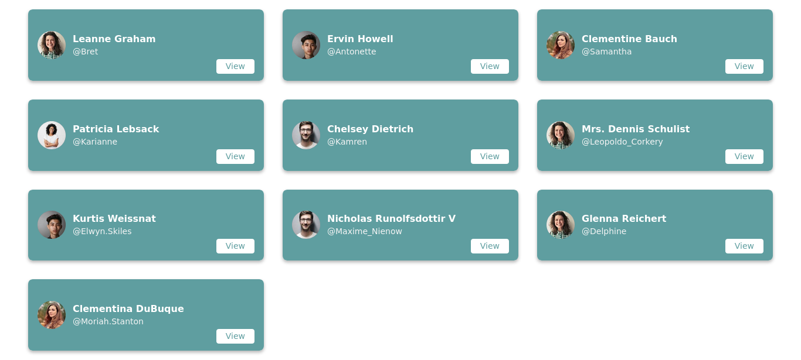
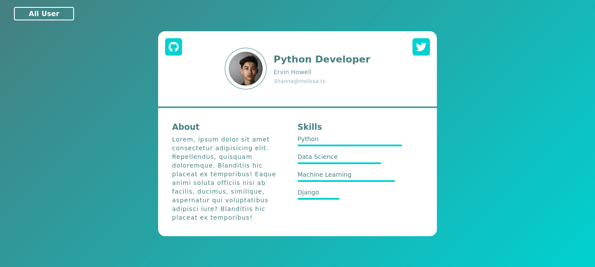

# Flask User Profil App
Bu uygulamada `user.json` dosyası içerisinde bulunan kullanıcı verileri Flask ve Python ile görüntülendi.<br>
İlk kez Flask kullandım ve Flask ın temel yapısını öğrenmeyi hedefledim.

## Öğrendiklerim
* Flask route yapısı
* Jinja Template kullanımı
* Template Kalıtımı
* Json dosyasından veri çekme
* url_for() kullanımı
* static dosyaların HTML içerisinde kullanımı

### Uygulamayı Çalıştırma
> Linux için
```
export FLASK_APP=app
export FLASK_ENV=development
flask run
```

#### Ekran Görüntüleri


